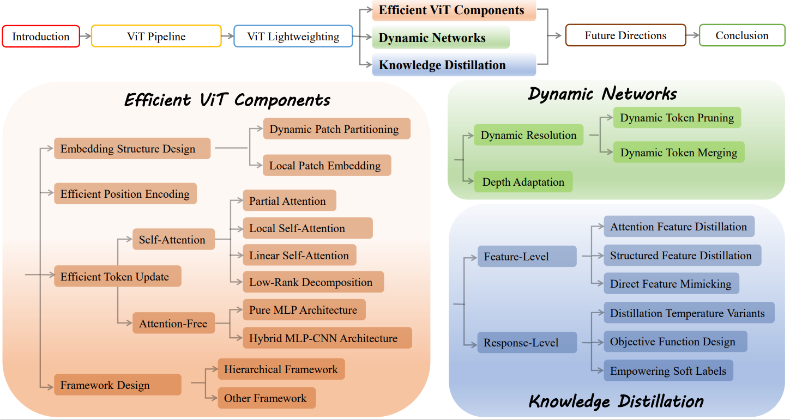

# Lightweight-VIT
## Abstract
The transformer architecture has achieved significant success in natural language processing, motivating its adaptation to computer vision tasks. 
Unlike convolutional neural networks, vision transformers inherently capture long-range dependencies and enable parallel processing, yet lack inductive biases and efficiency benefits, facing significant computational and memory challenges that limit its real-world applicability. 
This paper surveys various online strategies for generating lightweight vision transformers for image recognition, focusing on three key areas: efficient component design, dynamic network, and knowledge distillation. 
We evaluate the corresponding exploration for each topic using ImageNet benchmark, analyzing trade-offs among precision, parameters, throughput, and more to highlight their respective advantages, disadvantages, and flexibility. 
Finally, we propose future research directions and potential   challenges in the lightweighting of vision transformers, with the aim of inspiring further exploration and providing practical guidance for the community.
## Overview of PaPer

## content
- [Efficient ViT Components](#efficient-vit-components)
  - [Embedding Structure Design](embedding-structure-design)
  - [Efficient Position Encoding](efficient-position-encoding)
  - [Efficient Token Update](efficient-token-update)
  - [Framework Design](framework-design)
- [Dynamic Network](#dynamic-network)
  - [Dynamic Resolution](dynamic-resolution)
  - [Depth Adaptation](depth-adaptation)
- [Knowledge Distillation](#knowledge-distillation)
  - [Feature Knowledge Distillation](feature-knowledge-distillation)
  - [Response Knowledge Distillation](response-knowledge-distillation)

## Efficient ViT Components
1. **Embedding Structure Design**
2. **Efficient Position Encoding**
3. **Efficient Token Update**
4. **Framework Design**
## Dynamic Network
1. **Dynamic Resolution**
2. **Depth Adaptation**
## Knowledge Distillation
1. **Feature Knowledge Distillation**
2. **Response Knowledge Distillation**
